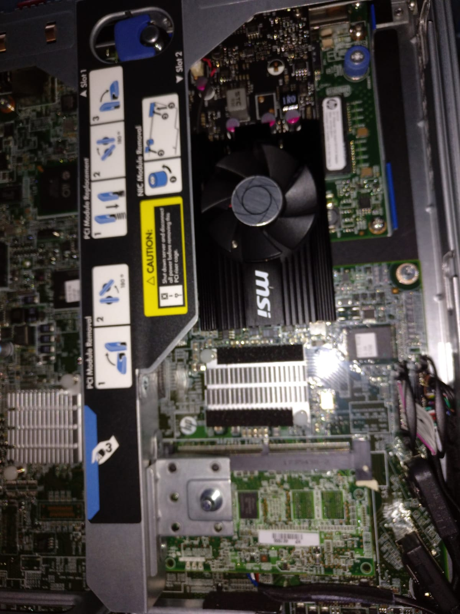
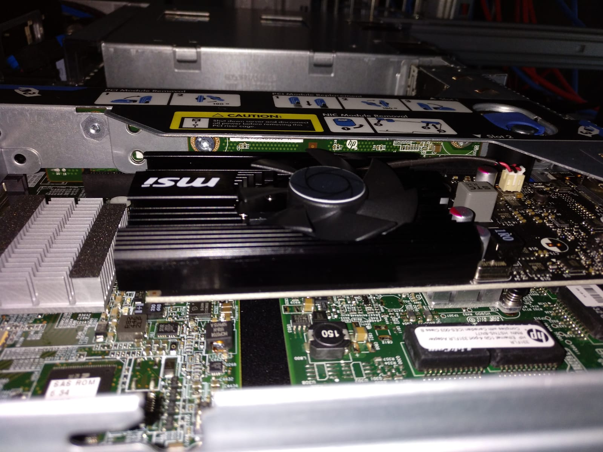
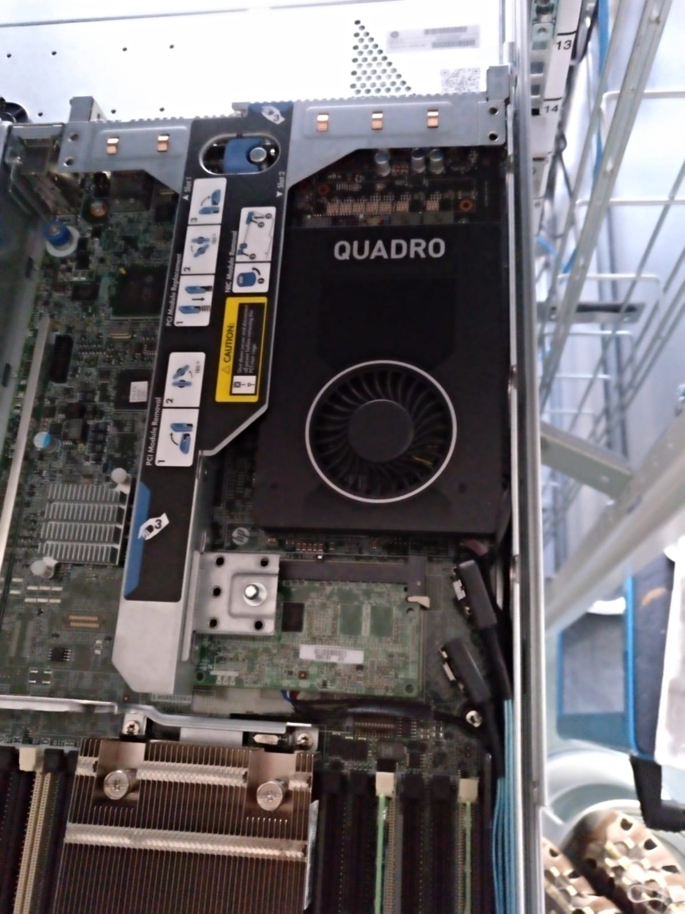
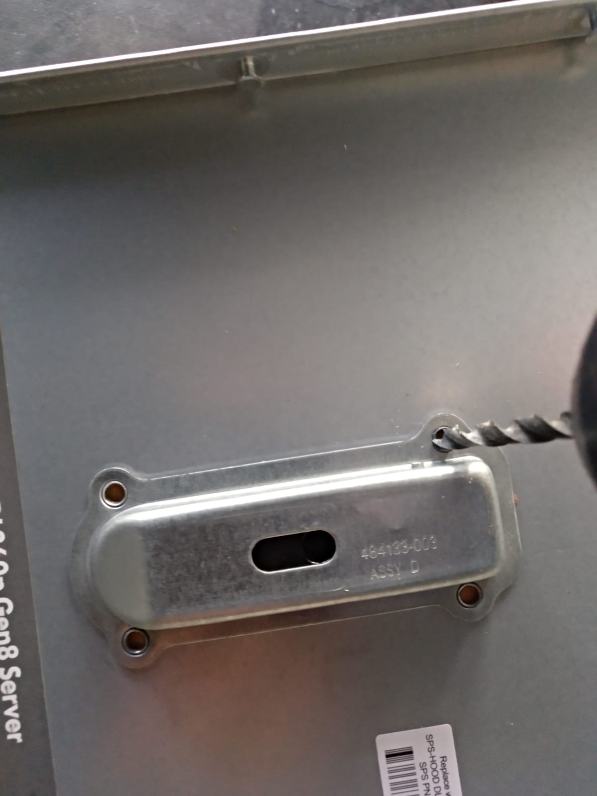

# CUDA on a HP ProLiant DL360p G8 server  

We tested two ways to use a Nvidia compatible GPU card in a HP ProLiant DL 360 rackmount server for number crunching with Cuda. 

The challange was to find:
1) a low (not low profile) card with only 1 PCI slot high (with a cooler  not higher than one slot)
2) a card that fits in full-height and half-length slot
3) a low power consuming card that take its power via PCI bus and do not need extra power plug
 

### ------------------------------------------

## MSI GeForce GT 1030
First we use a very cheap card (MSI GeForce GT 1030 with 384 cuda cores) that was working fine. We are using Linux and mathlab.
This card can be used without modifications. 

MSI GeForce GT 1030 (e.G.: https://www.amazon.de/dp/B07D9MQDP4/):
- 384 CUDA Cores
- 2GB 64-Bit DDR4
- PCIe 3.0 x16 (Uses x4)
- Maximum Power Consumption 	30 W

### ------------------------------------------

	
## NVIDIA Quadro P2000
With a grant from Nvidia to one of our research group  we could use a NVIDIA Quadro P2000. 

**WARNING: You need to modifiy the hood cover and remove the the opener. Maybe you lose your warranty!**

NVIDIA Quadro P2000 (e.G.: https://www.amazon.de/dp/B06XB7PFLD): 
- CUDA Cores 	1024
- GPU Memory 	5 GB GDDR5	
- System Interface 	PCIe 3.0 x16
- Maximum Power Consumption 	75 W

Remove the opener by drilling out the opener rivets. Otherwise you could not close the top of the server. 
Seal the whole with duct tape or what you like if no server is above this one in the rack. The card should 
benefit of of the server ventilation. 

### ------------------------------------------

Both solutions are working fine for cuda number crunching. 

We did not use or test the display port!

### ------------------------------------------

QuickSpecs
HP ProLiant DL360 Generation 8 (G8) (https://h20195.www2.hpe.com/v2/getdocument.aspx?docname=c04128242)

- PCIe 3.0  x16 expansion slot (Full-height / half-length)
- PCIe 3.0  x8  expansion slot (Low Profile)

### ------------------------------------------

Could work - not tested:

Inno3D GeForce GTX 1050Ti 1-Slot Ed. 4GB GDDR5 (e.G. https://www.amazon.de/dp/B07FNTWMS2)
- CUDA Cores 	768
- GPU Memory 	4 GB GDDR5
- System Interface 	PCI Express 3.0
- Maximum Power Consumption 75W

NVIDIA Quadro P2200 5GB GDDR5 PCIe 3.0 (https://www.amazon.de/dp/B07T5XCB2N)
- CUDA Cores 	1280
- GPU Memory 	5 GB GDDR5
- System Interface 	PCI Express 3.0
- Maximum Power Consumption 75 Watt

HP NVIDIA GeForce GT 730 2GB PCIe x8 GFX (e.G. https://www.amazon.de/HP-Nvidia-PCIe-Graphics-Card/dp/B06X92G36L)
- 384 CUDA Cores
- 2GB 64-Bit DDR4
- PCIe 2.0 x8 
- Maximum Power Consumption 	23W

(This card uses the x8 PCI-Slot and may be used parallel to a  GeForce GT 1030 card - not tested) 

